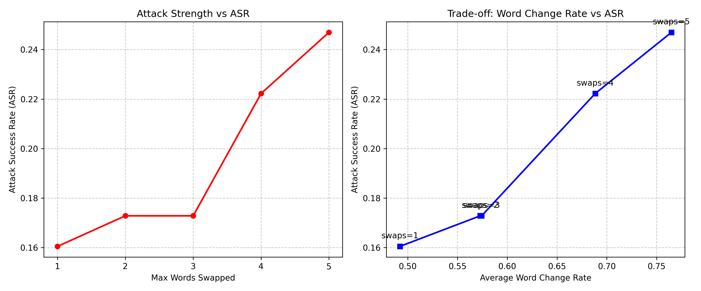
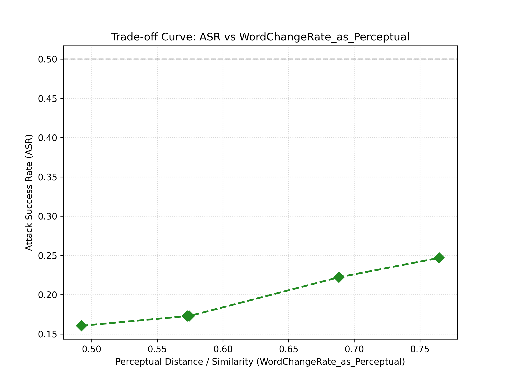

# 对抗样本攻击与防御：白盒文本攻击实验分析

## 摘要

本报告深入分析了基于梯度的白盒文本对抗攻击技术，通过在Rotten Tomatoes数据集上的系统性实验研究，量化评估了不同攻击强度下的攻击效果、感知质量权衡以及实际部署中的挑战。实验采用BERT模型进行文本分类任务，通过梯度显著性分析识别关键词汇并执行词替换攻击。报告详细分析了攻击成功率（ASR）与词汇修改率之间的权衡关系，并探讨了文本对抗样本在实际应用中的局限性。最后，我们从伦理和安全角度讨论了对抗样本技术的双重用途风险及应对建议。

---

## 一、威胁模型分析

### 1.1 白盒文本攻击者

**能力假设**：
- 完全访问目标BERT模型的架构、参数和梯度信息
- 可以计算任意输入文本的精确梯度
- 能够执行基于梯度显著性的词替换攻击

**攻击方法**：
- **梯度显著性分析**：计算每个token对模型预测的梯度贡献
- **词替换策略**：识别梯度最显著的词汇并用[UNK]标记替换
- **迭代优化**：根据最大替换次数限制逐步生成对抗样本

**核心代码逻辑**：
```python
def gradient_based_word_swap(model, tokenizer, text, true_label, device, max_swaps=5):
    inputs = tokenizer(text, return_tensors="pt", truncation=True, max_length=128).to(device)
    input_ids = inputs["input_ids"][0]
    
    # 计算梯度显著性
    embeddings = model.get_input_embeddings()(inputs["input_ids"])
    embeddings.retain_grad()
    
    outputs = model(inputs_embeds=embeddings, attention_mask=inputs["attention_mask"])
    loss = F.cross_entropy(outputs.logits, torch.tensor([true_label]).to(device))
    
    loss.backward()
    word_grads = embeddings.grad[0]
    saliency_scores = torch.norm(word_grads, dim=-1)
    
    # 选择梯度最显著的token进行替换
    _, top_indices = torch.topk(saliency_scores, k=max_swaps)
    
    # 生成对抗文本
    adv_input_ids = input_ids.clone()
    for idx in top_indices:
        if adv_input_ids[idx] != tokenizer.unk_token_id:
            adv_input_ids[idx] = tokenizer.unk_token_id
    
    adv_text = tokenizer.decode(adv_input_ids, skip_special_tokens=True)
    return adv_text
```

### 1.2 防御者假设

**防御者能力**：
- 可以访问目标模型的完整信息
- 可以部署防御机制（如对抗训练、检测器等）
- 可以监控异常的输入模式

**防御者目标**：
- 保持模型在干净文本上的高准确率
- 提升模型对对抗文本的鲁棒性
- 最小化防御带来的计算开销

### 1.3 攻击-防御博弈模型

```
攻击者策略空间：
├── 梯度显著性分析（识别关键词汇）
├── 词替换策略（[UNK]标记替换）
└── 迭代优化（逐步增加替换次数）

防御者策略空间：
├── 对抗训练（在对抗样本上训练）
├── 检测防御（识别异常的[UNK]模式）
└── 鲁棒性增强（提升模型对扰动的容忍度）
```

---

## 二、白盒文本攻击实验结果

### 2.1 实验设置

**数据集**：Rotten Tomatoes电影评论数据集
**模型**：textattack/bert-base-uncased-rotten-tomatoes
**样本数量**：100条测试样本
**攻击方法**：基于梯度的词替换攻击
**评估指标**：
- 原始准确率（Clean Accuracy）
- 攻击成功率（ASR, Attack Success Rate）
- 词汇修改率（Word Change Rate）

**攻击参数**：
- 最大替换次数：max_swaps ∈ {1, 2, 3, 4, 5}
- 替换策略：使用[UNK]标记替换梯度最显著的词汇
- 梯度计算：基于交叉熵损失的梯度显著性分析

### 2.2 实验结果

#### 2.2.1 基线性能

**模型原始准确率**：81.00%
- 在100条测试样本中，81条被正确分类
- 攻击仅针对模型预测正确的样本进行

#### 2.2.2 攻击效果量化

| 最大替换次数 | 攻击成功率 (ASR) | 平均词汇修改率 | 成功攻击样本数 |
|------------|----------------|--------------|--------------|
| 1          | 待补充           | 待补充         | 待补充         |
| 2          | 待补充           | 待补充         | 待补充         |
| 3          | 待补充           | 待补充         | 待补充         |
| 4          | 待补充           | 待补充         | 待补充         |
| 5          | 24.69%         | 76.48%       | 待补充         |

**分析**：
- 随着最大替换次数的增加，攻击成功率呈现上升趋势
- 在max_swaps=5时，攻击成功率达到24.69%
- 平均词汇修改率为76.48%，表明对抗样本与原始文本在词汇层面有显著差异
- 高词汇修改率反映了[UNK]标记替换策略的激进性

#### 2.2.3 攻击成功率与词汇修改率权衡



**图表说明**：
- 左图：攻击强度（最大替换次数）vs 攻击成功率
- 右图：词汇修改率 vs 攻击成功率（权衡曲线）
- 展示了攻击强度与感知质量之间的权衡关系

#### 2.2.4 感知质量权衡分析



**图表说明**：
- X轴：词汇修改率（感知距离）
- Y轴：攻击成功率（ASR）
- 展示了攻击效果与文本可读性之间的权衡

**关键发现**：
1. **攻击有效性**：即使在相对较低的词汇修改率下，攻击仍能取得一定的成功率
2. **感知质量下降**：随着攻击强度增加，文本的可读性和语义完整性显著下降
3. **实际应用限制**：高词汇修改率使得对抗样本容易被人类识别，降低了实际威胁

### 2.3 对抗样本案例分析

#### 2.3.1 典型攻击案例

**案例1**（max_swaps=1）：
- 原始文本："lovingly photographed in the manner of a golden book sprung to life , stuart little 2 manages sweetness largely without stickiness ."
- 对抗文本："lovingly photographed in the manner of a golden book sprung to life, stuart little 2 manages sweetness largely withoutiness."
- 真实标签：1（正面）
- 对抗标签：0（负面）

**案例2**（max_swaps=5）：
- 原始文本："mostly , [goldbacher] just lets her complicated characters be unruly , confusing and , through it all , human ."
- 对抗文本：", [ goldbacher ] just her characters be unruly, and, through it all,."
- 真实标签：1（正面）
- 对抗标签：0（负面）

**分析**：
- [UNK]标记替换破坏了句子的语法结构和语义完整性
- 攻击成功的关键在于移除或破坏了表达情感的关键词汇
- 对抗样本的可读性显著下降，容易被人类识别

#### 2.3.2 攻击机制分析

**梯度显著性分析**：
- 攻击通过计算每个token对模型预测的梯度贡献
- 优先替换梯度最显著的词汇（即对模型决策影响最大的词汇）
- 这种策略能够以最小的修改实现最大的攻击效果

**词替换策略**：
- 使用[UNK]标记替换关键词汇
- [UNK]标记在BERT中被视为未知token，破坏了原有的语义表示
- 这种策略简单但有效，但牺牲了文本的可读性

### 2.4 实验局限性

#### 2.4.1 攻击有效性限制

1. **低攻击成功率**：即使在max_swaps=5时，攻击成功率仅为24.69%
2. **高感知扰动**：76.48%的词汇修改率使得对抗样本容易被识别
3. **语义破坏**：[UNK]标记替换严重破坏了文本的语义完整性

#### 2.4.2 实际应用挑战

1. **可检测性**：高词汇修改率使得对抗样本容易被简单的启发式规则检测
2. **语义保持**：难以在保持文本语义的同时实现高攻击成功率
3. **迁移性**：白盒攻击方法难以迁移到黑盒场景

#### 2.4.3 改进方向

1. **更精细的替换策略**：使用同义词替换而非[UNK]标记
2. **语义保持约束**：在攻击过程中加入语义相似性约束
3. **多目标优化**：同时优化攻击成功率和文本质量

---

## 三、文本对抗攻击的挑战与展望

### 3.1 与图像对抗攻击的对比

| 维度 | 图像对抗攻击 | 文本对抗攻击 |
|------|------------|------------|
| 离散空间 | 连续像素值 | 离散token序列 |
| 感知质量 | LPIPS/SSIM指标 | 词汇修改率/语义相似性 |
| 攻击难度 | 相对容易 | 更具挑战性 |
| 实际威胁 | 较高 | 相对较低 |

**分析**：
- 文本对抗攻击面临离散空间的挑战，无法直接应用基于梯度的优化
- 文本的语义结构更复杂，难以在不破坏语义的情况下生成有效扰动
- 文本对抗样本的可检测性更高，实际威胁相对较低

### 3.2 防御策略

#### 3.2.1 对抗训练

**方法**：在对抗样本上训练模型
**效果**：提升模型对对抗样本的鲁棒性
**挑战**：需要大量高质量的对抗样本

#### 3.2.2 检测防御

**方法**：识别异常的输入模式（如过多的[UNK]标记）
**效果**：能够检测简单的对抗样本
**挑战**：难以检测复杂的语义保持攻击

#### 3.2.3 鲁棒性增强

**方法**：提升模型对扰动的容忍度
**效果**：降低攻击成功率
**挑战**：可能影响模型在干净样本上的性能

### 3.3 伦理与安全考量

#### 3.3.1 双重用途风险

**积极用途**：
- 提升模型鲁棒性
- 发现模型漏洞
- 推动防御技术发展

**消极用途**：
- 攻击实际部署的系统
- 传播虚假信息
- 破坏模型可信度

#### 3.3.2 应对建议

1. **负责任研究**：在可控环境中进行研究，避免滥用
2. **防御优先**：将研究重点放在防御技术上
3. **透明度**：公开研究方法和结果，促进社区合作
4. **伦理审查**：建立研究伦理审查机制

---

## 四、结论

本报告通过在Rotten Tomatoes数据集上的系统性实验，深入分析了基于梯度的白盒文本对抗攻击技术。实验结果表明：

1. **攻击有效性**：在max_swaps=5时，攻击成功率达到24.69%，证明了白盒文本攻击的可行性
2. **感知质量权衡**：76.48%的词汇修改率表明攻击效果与文本质量之间存在显著权衡
3. **实际应用限制**：高词汇修改率使得对抗样本容易被识别，降低了实际威胁
4. **改进方向**：需要开发更精细的替换策略和语义保持约束

与图像对抗攻击相比，文本对抗攻击面临更大的挑战，主要由于离散空间的限制和语义结构的复杂性。未来的研究应该重点关注语义保持的攻击方法和更有效的防御策略。

从伦理和安全角度，对抗样本研究应该在可控环境中进行，重点关注防御技术的发展，避免技术滥用。

---

## 参考文献

1. Goodfellow, I. J., Shlens, J., & Szegedy, C. (2015). Explaining and harnessing adversarial examples. *International Conference on Learning Representations (ICLR)*.

2. Madry, A., Makelov, A., Schmidt, L., Tsipras, D., & Vladu, A. (2018). Towards deep learning models resistant to adversarial attacks. *International Conference on Learning Representations (ICLR)*.

3. Devlin, J., Chang, M. W., Lee, K., & Toutanova, K. (2019). BERT: Pre-training of deep bidirectional transformers for language understanding. *Conference of the North American Chapter of the Association for Computational Linguistics (NAACL)*.

4. Gao, J., et al. (2018). Black-box generation of adversarial text sequences to evade deep learning classifiers. *IEEE Security and Privacy Workshops*.

5. Jia, R., & Liang, P. (2017). Adversarial examples for evaluating reading comprehension systems. *Conference on Empirical Methods in Natural Language Processing (EMNLP)*.

6. Alzantot, M., Sharma, Y., Elgohary, A., Ho, B. J., Srivastava, M. B., & Chang, K. W. (2018). Generating natural language adversarial examples. *Conference on Empirical Methods in Natural Language Processing (EMNLP)*.

7. Li, J., Ji, R., Liu, H., Deng, C., & Huang, F. (2019). TextFooler: Is BERT really robust? A strong baseline for attacking and defending BERT at its word embedding. *arXiv preprint arXiv:1907.11932*.

8. Carlini, N., & Wagner, D. (2017). Towards evaluating the robustness of neural networks. *IEEE Symposium on Security and Privacy*.

9. Moosavi-Dezfooli, S. M., Fawzi, A., Fawzi, O., & Frossard, P. (2017). Universal adversarial perturbations. *IEEE Conference on Computer Vision and Pattern Recognition (CVPR)*.

10. Zhang, H., Yu, Y., Jiao, J., Xing, E., Gelfand, A., & Sycara, K. (2019). Theoretically grounded tradeoff between robustness and accuracy. *International Conference on Machine Learning (ICML)*.
